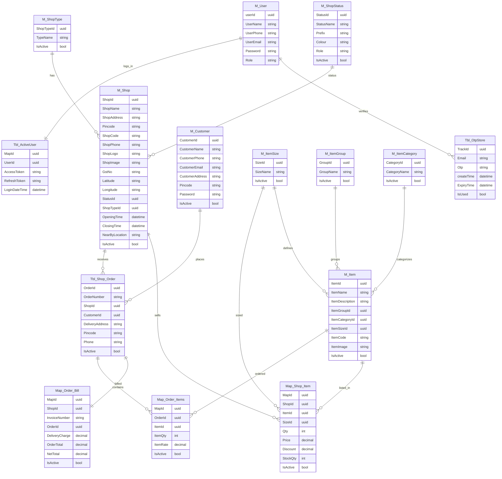

# CityShop API

CityShop is an ASP.NET Core REST API for managing shops, items, customers, orders, users, and OTP authentication. It is built with Entity Framework Core and SQL Server, and exposes controllers for e-commerce operations around shop listings, catalog management, order processing, and user authentication.

## Key Features

- User registration and JWT-based login
- Shop management with shop types and shop status
- Item catalog management with categories, groups, and sizes
- Shop item mapping for pricing, stock, and discounts
- Order management with bills and order item mapping
- Customer management
- OTP verification support
- Centralized exception handling
- Swagger API documentation for development

## Architecture

The project follows a layered architecture:

- `Controllers/` - API controllers for each domain entity
- `Services/` - business logic implementations
- `Repositories/` - data access abstractions and implementations
- `Interfaces/` - service and repository contracts
- `Model/` - EF Core entity models and `ApplicationDBContext`
- `DTO/` - request/response transfer objects
- `Helpers/` - utility classes such as encryption, JWT token generation, and response helpers
- `Middleware/` - custom middleware for consistent error handling

## Database

The API is designed for SQL Server and uses Entity Framework Core for data access. The `ApplicationDBContext` defines DbSet entities including:

- `Users`, `ActiveUsers`, `OtpStores`
- `Customers`
- `Shops`, `ShopTypes`, `ShopStatuses`
- `Items`, `ItemCategories`, `ItemGroups`, `ItemSizes`
- `ShopItems`, `ShopOrders`, `OrderItems`, `OrderBills`, `Reviews`

## Getting Started

### Setup

1. Clone the repository.
2. Open the solution `cityshop-api.sln`.
3. Configure the SQL Server connection string in `appsettings.json` or `appsettings.Development.json`:

```json
"ConnectionStrings": {
  "DefaultConnection": "Server=YOUR_SERVER;Database=CityShopDb;Trusted_Connection=True;"
}
```

4. Configure JWT settings in `appsettings.json`:

```json
"Jwt": {
  "Key": "YOUR_SECRET_KEY",
  "Issuer": "your-app",
  "Audience": "your-app-audience"
}
```

5. Apply database migrations or create the schema manually using the SQL files in `DB/tables.sql`.

## Authentication

The API uses JWT Bearer authentication. Public endpoints such as `register` and `login` are allowed anonymously, while other endpoints require a valid JWT token.

## Important Controllers

- `UserController` - register users and login
- `ShopController` - manage shops
- `ItemController` - manage items
- `ShopItemMapController` - manage shop-specific item listings and pricing
- `OrderController` - create and manage shop orders
- `CustomerController` - manage customer records
- `ShopTypeController`, `ShopStatusController`, `ItemCategoryController`, `ItemGroupController`, `ItemSizeController` - manage related lookup data

## Tools and Dependencies

- ASP.NET Core 6
- Entity Framework Core 6
- Microsoft.EntityFrameworkCore.SqlServer
- Microsoft.AspNetCore.Authentication.JwtBearer
- Swashbuckle.AspNetCore for Swagger
- MailKit for email handling

## Notes

- CORS is configured to allow all origins, methods, and headers.
- Custom exception middleware is used to standardize API error responses.
- Routes are configured to use lowercase URLs.

## Database ERD


